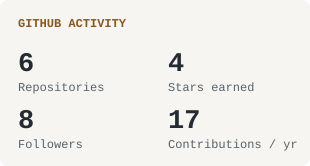
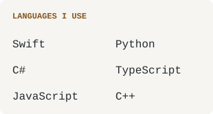

<picture>
  <source media="(prefers-reduced-motion: reduce) and (prefers-color-scheme: dark)" srcset="./assets/profile-swift-python-ml-dark-still.svg">
  <source media="(prefers-reduced-motion: reduce)" srcset="./assets/profile-swift-python-ml-light-still.svg">
  <source media="(prefers-color-scheme: dark)" srcset="./assets/profile-swift-python-ml-dark.svg">
  
</picture>
 
80 × 40 characters · Generated with Python · <a href="https://github.com/byrm-tsn/byrm-tsn/blob/main/scripts/render_profile.py">View the code ↗</a>

  <a href="https://bayramtosun.dev">Website</a> ·
  <a href="mailto:bayramtosun@outlook.com">Email</a> ·
  <a href="https://linkedin.com/in/bayram-tosun-a19217102">LinkedIn</a> ·
  <a href="https://instagram.com/bayram.jpeg">Photography</a> ·
  <a href="https://medium.com/@bayramtosun">Medium</a> ·
  <a href="https://x.com/9byrmtsn">X</a>

Computer Science **BSc & MSc graduate** in **London**. I build software with **Swift, Python and C#**, with interests across backend systems, web development and machine learning. Away from code, I'm usually behind a camera.

  <b>Tools I work with</b>  
  

<!-- BEGIN AUTO:stats -->

<picture>
  <source media="(prefers-color-scheme: dark)" srcset="./assets/account-activity-dark.svg">
  
</picture>
<picture>
  <source media="(prefers-color-scheme: dark)" srcset="./assets/language-overview-dark.svg">
  
</picture>

About these numbers

**6 owned repositories**, including private repositories. This account-wide total was verified on **2026-10-01**.

Other figures updated **2026-10-01**: **4 stars earned** on owned public non-fork repositories, **8 followers**, and **15 contributions** visible on my public calendar over the last 365 days.

**Repository language shares:** Python 96.2%, C 2.1%, HTML 0.6%, C++ 0.4%, Cython 0.4%, Other 0.3%

The repository total is a dated account snapshot. The other activity figures and repository language shares use public GitHub data and refresh daily through [GitHub Actions](https://github.com/byrm-tsn/byrm-tsn/actions/workflows/refresh-profile.yml). Language shares count code bytes in non-fork repositories, not proficiency or my complete body of work. The **Languages I use** card lists a selection from my broader toolkit.

<!-- END AUTO:stats -->

  
  &nbsp;
  

