<picture>
  <source media="(prefers-reduced-motion: reduce) and (prefers-color-scheme: dark) and (max-width: 900px)" srcset="./assets/header-dark-mobile-still.svg">
  <source media="(prefers-reduced-motion: reduce) and (max-width: 900px)" srcset="./assets/header-light-mobile-still.svg">
  <source media="(prefers-reduced-motion: reduce) and (prefers-color-scheme: dark)" srcset="./assets/header-dark-still.svg">
  <source media="(prefers-reduced-motion: reduce)" srcset="./assets/header-light-still.svg">
  <source media="(prefers-color-scheme: dark) and (max-width: 900px)" srcset="./assets/header-dark-mobile.svg">
  <source media="(max-width: 900px)" srcset="./assets/header-light-mobile.svg">
  <source media="(prefers-color-scheme: dark)" srcset="./assets/header-dark.svg">
  
</picture>

  <a href="https://bayramtosun.dev"><b>My corner of the internet ↗</b></a>
  &nbsp; · &nbsp;
  <a href="mailto:bayramtosun@outlook.com"><b>Say hello ↗</b></a>

 

### A little about me

I'm **Bayram**, a **Computer Science BSc & MSc graduate** based in **London**. I enjoy turning ideas into software, exploring how machines learn, and understanding the logic underneath it all.

- **I build** — backend systems, web applications, and practical software with Python, Django, C#, Swift, and TypeScript.
- **I explore** — machine learning, computer vision, and the maths that makes them work.
- **I notice** — light, composition, and the little details. Photography lives at [@bayram.jpeg](https://instagram.com/bayram.jpeg).

Some days it's code. Some days it's a camera. Usually, it's curiosity.

### My toolkit

**Software** &nbsp; `Python` `Django` `C#` `Swift` `TypeScript` `React`

**Machine learning** &nbsp; `PyTorch` `TensorFlow` `OpenCV`

**Data & infrastructure** &nbsp; `PostgreSQL` `Docker` `Git` `Linux` `Google Cloud`

  
A few more tools in the drawer

   
  C · C++ · JavaScript · HTML · CSS · MySQL

 

<picture>
  <source media="(prefers-reduced-motion: reduce) and (prefers-color-scheme: dark) and (max-width: 900px)" srcset="./assets/curiosity-dark-mobile-still.svg">
  <source media="(prefers-reduced-motion: reduce) and (max-width: 900px)" srcset="./assets/curiosity-light-mobile-still.svg">
  <source media="(prefers-reduced-motion: reduce) and (prefers-color-scheme: dark)" srcset="./assets/curiosity-dark-still.svg">
  <source media="(prefers-reduced-motion: reduce)" srcset="./assets/curiosity-light-still.svg">
  <source media="(prefers-color-scheme: dark) and (max-width: 900px)" srcset="./assets/curiosity-dark-mobile.svg">
  <source media="(max-width: 900px)" srcset="./assets/curiosity-light-mobile.svg">
  <source media="(prefers-color-scheme: dark)" srcset="./assets/curiosity-dark.svg">
  
</picture>

 

  <a href="https://www.linkedin.com/in/bayram-tosun-a19217102/"><b>LinkedIn</b></a>
  &nbsp; · &nbsp;
  <a href="https://instagram.com/bayram.jpeg"><b>Photography</b></a>
  &nbsp; · &nbsp;
  <a href="https://medium.com/@bayramtosun"><b>Writing</b></a>
  &nbsp; · &nbsp;
  <a href="https://x.com/9byrmtsn"><b>X</b></a>

  <a href="https://github.com/byrm-tsn?tab=repositories">Explore my code</a>
  &nbsp; · &nbsp;
  <a href="https://www.buymeacoffee.com/bayramtosun">Buy me a coffee</a>

