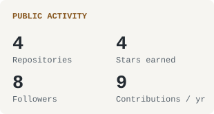
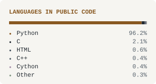

<picture>
  <source media="(prefers-reduced-motion: reduce) and (prefers-color-scheme: dark)" srcset="./assets/profile-dark-still.svg">
  <source media="(prefers-reduced-motion: reduce)" srcset="./assets/profile-light-still.svg">
  <source media="(prefers-color-scheme: dark)" srcset="./assets/profile-dark.svg">
  
</picture>

  <a href="https://bayramtosun.dev">Website</a> ·
  <a href="mailto:bayramtosun@outlook.com">Email</a> ·
  <a href="https://linkedin.com/in/bayram-tosun-a19217102">LinkedIn</a> ·
  <a href="https://instagram.com/bayram.jpeg">Photography</a> ·
  <a href="https://medium.com/@bayramtosun">Medium</a> ·
  <a href="https://x.com/9byrmtsn">X</a>

Computer Science **BSc & MSc graduate** in **London**, building backend software and exploring machine learning. Away from code, I'm usually behind a camera.

  <b>Tools I work with</b>  
  

<!-- BEGIN AUTO:stats -->

<picture>
  <source media="(prefers-color-scheme: dark)" srcset="./assets/activity-dark.svg">
  
</picture>
<picture>
  <source media="(prefers-color-scheme: dark)" srcset="./assets/languages-dark.svg">
  
</picture>

About these numbers

Updated **2026-10-01**. **4 public repositories**, **4 stars earned** on owned non-fork repositories, **8 followers**, and **9 contributions** visible on my public calendar over the last 365 days.

**Language shares:** Python 96.2%, C 2.1%, HTML 0.6%, C++ 0.4%, Cython 0.4%, Other 0.3%

These measure code bytes in my public, non-fork repositories, not proficiency. Refreshed daily through [GitHub Actions](https://github.com/byrm-tsn/byrm-tsn/actions/workflows/refresh-profile.yml).

<!-- END AUTO:stats -->

  
  &nbsp;
  

