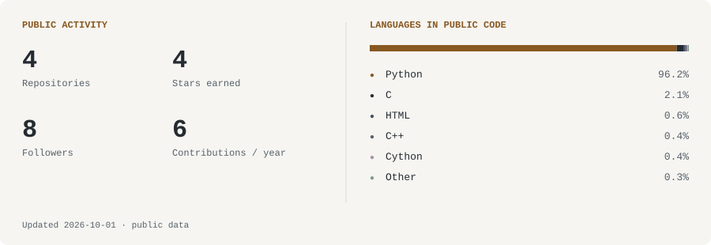

<picture>
  <source media="(prefers-reduced-motion: reduce) and (prefers-color-scheme: dark) and (max-width: 600px)" srcset="./assets/hello-dark-mobile-still.svg">
  <source media="(prefers-reduced-motion: reduce) and (max-width: 600px)" srcset="./assets/hello-light-mobile-still.svg">
  <source media="(prefers-reduced-motion: reduce) and (prefers-color-scheme: dark) and (max-width: 1100px)" srcset="./assets/hello-dark-compact-still.svg">
  <source media="(prefers-reduced-motion: reduce) and (max-width: 1100px)" srcset="./assets/hello-light-compact-still.svg">
  <source media="(prefers-reduced-motion: reduce) and (prefers-color-scheme: dark)" srcset="./assets/hello-dark-still.svg">
  <source media="(prefers-reduced-motion: reduce)" srcset="./assets/hello-light-still.svg">
  <source media="(prefers-color-scheme: dark) and (max-width: 600px)" srcset="./assets/hello-dark-mobile.svg">
  <source media="(max-width: 600px)" srcset="./assets/hello-light-mobile.svg">
  <source media="(prefers-color-scheme: dark) and (max-width: 1100px)" srcset="./assets/hello-dark-compact.svg">
  <source media="(max-width: 1100px)" srcset="./assets/hello-light-compact.svg">
  <source media="(prefers-color-scheme: dark)" srcset="./assets/hello-dark.svg">
  
</picture>

  <a href="https://bayramtosun.dev"><b>Website ↗</b></a> &nbsp; · &nbsp;
  <a href="mailto:bayramtosun@outlook.com"><b>Email ↗</b></a> &nbsp; · &nbsp;
  <a href="https://linkedin.com/in/bayram-tosun-a19217102"><b>LinkedIn ↗</b></a>

### A little about me

I build backend systems and explore machine learning. I enjoy turning ideas into practical software and understanding the logic underneath.

My background is in **Computer Science, at both BSc and MSc level**. My interests span backend engineering, computer vision, and cloud tooling. Away from code, I spend time with a camera — you can find that side of me at [@bayram.jpeg](https://instagram.com/bayram.jpeg).

### Tools I work with

**Languages**

**Web & data**

**Machine learning & infrastructure**

### On GitHub

<!-- BEGIN AUTO:stats -->
<picture>
  <source media="(prefers-color-scheme: dark) and (max-width: 600px)" srcset="./assets/stats-dark-mobile.svg">
  <source media="(max-width: 600px)" srcset="./assets/stats-light-mobile.svg">
  <source media="(prefers-color-scheme: dark) and (max-width: 1100px)" srcset="./assets/stats-dark-compact.svg">
  <source media="(max-width: 1100px)" srcset="./assets/stats-light-compact.svg">
  <source media="(prefers-color-scheme: dark)" srcset="./assets/stats-dark.svg">
  
</picture>

About these numbers · accessible text

Updated **2026-10-01**. **4 public repositories**, **4 stars earned** on owned non-fork repositories, **8 followers**, and **6 contributions** visible on my public calendar over the last 365 days.

**Language shares:** Python 96.2%, C 2.1%, HTML 0.6%, C++ 0.4%, Cython 0.4%, Other 0.3%

Language shares measure code bytes in my public, non-fork repositories; they are not a measure of proficiency. The cards refresh daily through [GitHub Actions](https://github.com/byrm-tsn/byrm-tsn/actions/workflows/refresh-profile.yml).

<!-- END AUTO:stats -->

### Elsewhere

[Photography ↗](https://instagram.com/bayram.jpeg) &nbsp; · &nbsp; [Writing ↗](https://medium.com/@bayramtosun) &nbsp; · &nbsp; [X ↗](https://x.com/9byrmtsn) &nbsp; · &nbsp; [Buy me a coffee ↗](https://www.buymeacoffee.com/bayramtosun)

Find me at <a href="https://bayramtosun.dev">bayramtosun.dev</a> or say hello at <a href="mailto:bayramtosun@outlook.com">bayramtosun@outlook.com</a>.

  

